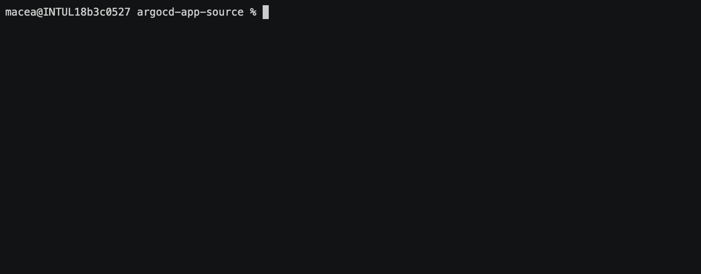
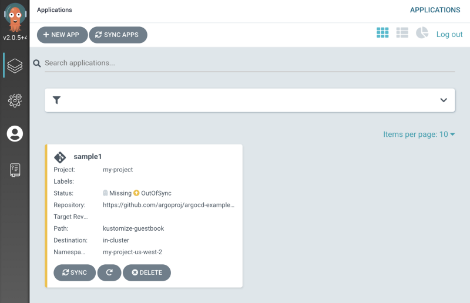
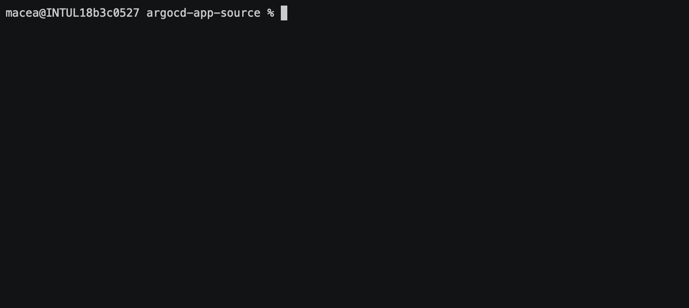

# AppSource CRD
A decentralized manager for ArgoCD — allow sub-admins to create and manage their own applications on ArgoCD.

## Example Spec

```yaml
apiVersion: argoproj.io/v1alpha1
kind: AppSource
metadata:
  name: sample1
  # RBAC restricted namespace
  namespace: my-project-us-west-2
  finalizers:
    # Deletes ArgoCD Application when you delete the AppSource
  - "application-finalizer.appsource.argoproj.io"
spec:
  # Path to ArgoCD Application
  path: kustomize-guestbook
  # Source Github repo for ArgoCD Application
  repoURL: https://github.com/argoproj/argocd-example-apps
```

## Example ConfigMap

```yaml
apiVersion: v1
kind: ConfigMap
metadata:
  name: argocd-appsource-cm
  namespace: argocd
data:
  # ArgoCD Server address
  argocd.address: localhost:8080
  # ArgoCD API Client Options
  argocd.clientOpts: "--insecure"
  # Project Profiles
  project.profiles: |
    - default:
        namePattern: .*
        spec:
          description: Default AppSource project
          sourceRepos:
            - '*'
```

## Installation
- Create the AppSource Controller and CRD by using a single install manifest
```shell
kubectl -n argocd apply -f https://raw.githubusercontent.com/argoproj-labs/appsource/master/manifests/install.yaml 
```

### Set Up
- Configure your AppSource controller using a configmap named [`argocd-appsource-cm`](./manifests/samples/sample_admin_config.yaml)
- Create an ArgoCD account with API capabilities
```shell
kubectl edit configmap argocd-cm -n argocd
```
```yaml
# Add this to the end of the file
data:
  accounts.appsource: apiKey, login
```
- Give your AppSource account the necessary RBAC permissions to manage ArgoCD resources
```shell
kubectl edit configmap argocd-rbac-cm -n argocd
```
```yaml
# Add this to the end of the file
data:
  policy.csv: |
    p, role:appsource, applications, *, */*, allow
    p, role:appsource, projects, *, *, allow
    p, role:appsource, repositories, *, *, allow
    p, role:appsource, cluster, *, *, allow
    p, role:appsource, clusters, *, *, allow
    g, appsource, role:appsource
```
- Create a secret containing your ArgoCD token named `argocd-appsource-secret`
```shell
export ARGOCD_TOKEN=$(argocd account generate-token --account appsource)
kubectl -n argocd create secret generic argocd-appsource-secret --from-literal argocd-token=$ARGOCD_TOKEN
```
- For more detailed instructions, see the [Getting Started Guide](docs/GETTING_STARTED.md)

# Usage
## Creating an ArgoCD Application



## Using the AppSource Status Resource

Users with access to the `argocd` namespace can see applications created by the controller through the ArgoCD UI



However, users without access to the `argocd` instance can use the AppSource Status field to see if their ArgoCD application was successfully created



## Deleting your AppSource instance

If you included a AppSource finalizer in your AppSource manifest, deleting the AppSource resource will also delete your ArgoCD application.


## Motivation
- Organizations would like to be able to provide development teams access to ArgoCD without needing to maintain/approve actions made to the Dev team's collection of applications.

